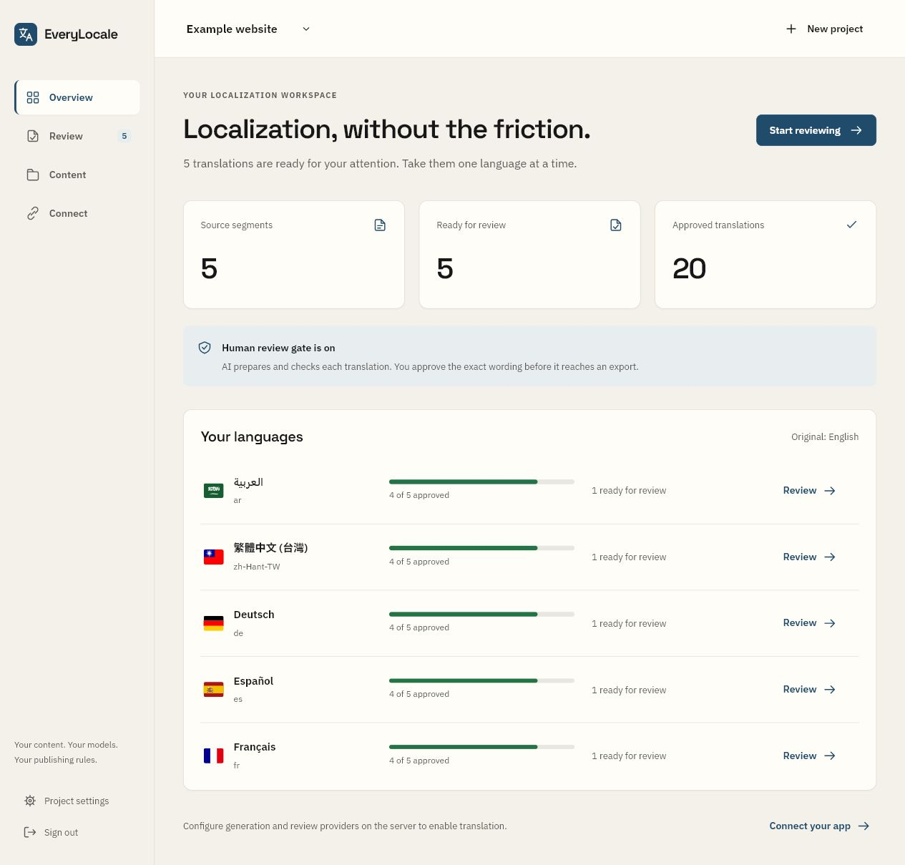
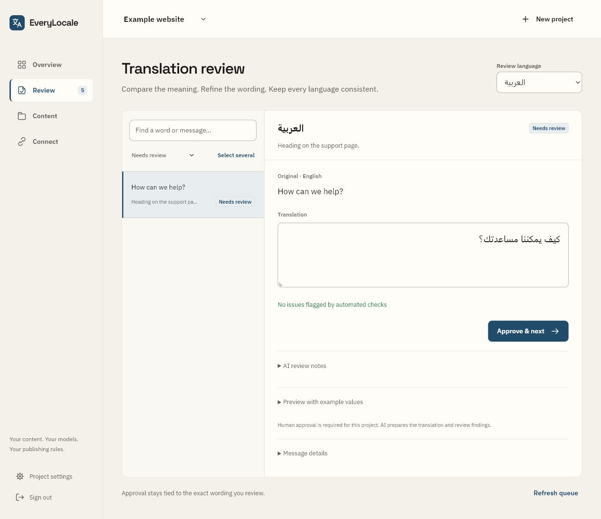

# EveryLocale

Keep your product up to date in every language.

[everylocale.com](https://everylocale.com) · [Get started](docs/GETTING-STARTED.md) · [Connect your app](docs/CONNECT.md)

EveryLocale translates the text you change, checks the result with a separate AI review, and gives your app a complete set of approved translations. Run it on your own computer or server, choose your models, and decide whether clean translations publish automatically or wait for a person.



## How it fits into your work

You write “Create a project” in your app's English messages file. EveryLocale prepares the other languages and protects variables, links, numbers, and formatting. Your build downloads the approved files and includes them in the next release. Visitors read those files; displaying a page does not make an AI request.

The next time you change the wording, run the same workflow. Unchanged translations are reused. If a model request fails or a translation needs attention, the current app stays available while you resolve the issue.

## Try your first translation

You'll need Node.js 22.16 or later and pnpm 9.15.9. Start with the [step-by-step guide](docs/GETTING-STARTED.md): it includes model settings, a sample file, the buttons to use, and the translated file you should get back.

```sh
git clone --branch develop https://github.com/bomsn/EveryLocale.git
cd EveryLocale
pnpm install --frozen-lockfile
pnpm build
pnpm run setup
```

Add your model settings to the generated `.env`, run `pnpm doctor` to check the configuration, then `pnpm start`. Open [localhost:4310](http://localhost:4310). The guide explains where to find your workspace sign-in token.

## Choose what to translate

- App messages: JSON, YAML, PO, and declared React/ICU messages.
- Written content: Markdown, MDX, HTML, and WordPress articles.
- Your release process: CLI commands for GitHub Actions or another CI runner, plus a server-side HTTP API.
- Your interface: React controls and request helpers for Remix 2 and Next.js, with Arabic direction, native language names, and multilingual SEO helpers.

English, Arabic, Taiwan Chinese, German, Spanish, and French are included in the default locale registry. You can configure additional target languages. Your app still needs to render translated messages and provide localized routes; the [connection guide](docs/CONNECT.md) shows where that work belongs.

## When a translation needs attention

The review workspace shows the original, the translation, and what the checks found. Edit the wording and send it through review again. Approval applies to that exact wording and source version. Choose a human approval gate if a person should check every translation.



Screenshots use fictional example content.

## Guides

| You want to… | Start here |
| --- | --- |
| Translate your first file | [Get started](docs/GETTING-STARTED.md) |
| Understand approvals, changes, and spending | [How the workflow works](docs/WORKFLOW.md) |
| Use translations in an app | [Connect your app](docs/CONNECT.md) |
| Translate during a release | [GitHub Actions and CI/CD](docs/CI-CD.md) |
| Look up a command | [CLI reference](docs/CLI.md) |
| Set up models or optional ChatGPT access | [Configuration](docs/CONFIGURATION.md) |
| Run a dependable service | [Hosting, backups, and alerts](docs/OPERATIONS.md) |
| Implement routing and search metadata | [Runtime integration](docs/INTEGRATION.md) |
| Build your own integration | [HTTP API](docs/API.md) |
| Connect a WordPress site | [WordPress setup](adapters/wordpress/README.md) |

## Cost and license

EveryLocale is [MIT-licensed](LICENSE), with no subscription or seat charge. Cloud model requests and hosting are billed by the providers you choose. Local models use your hardware. Set a project spending limit before translating; generation and review both count toward it. Optional ChatGPT access is subject to OpenAI's eligibility and account limits.

Bundled flags and fonts include their upstream licenses. See [Contributing](CONTRIBUTING.md) to contribute.
